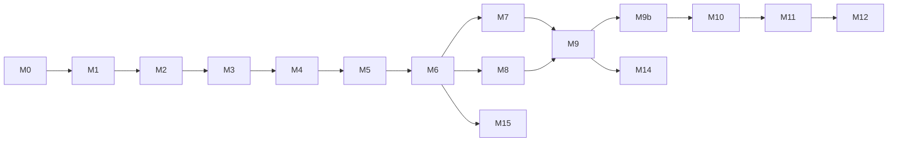

# NegSwift — macOS Lite Shell Plan

A macOS-only SwiftUI app that reuses **upstream NegPy** as a drop-in processing engine. No algorithm fork: NegSwift owns UI, orchestration, and packaging; NegPy owns pixels, pipeline, and file formats.

**License:** GPL-3.0 for the whole shipped product (Swift shell + bundled engine). NegPy is GPL-3.0; combining and distributing them requires the same license and source availability for NegSwift’s own code.

---

## Plan status (last updated: 2026-08-23)

| Milestone | Status | Notes |
|-----------|--------|-------|
| **M0** Bootstrap | **Done** | `Makefile`; GitHub CI |
| **M1** Engine CLI | **Done** | `info`, `open`; `tests/test_cli.py` |
| **M2** Render PNG | **Done** | `render` CLI; `tests/test_render.py` |
| **M3** NDJSON daemon | **Done** | `serve --stdio`, `serve --socket`, `cancel`; Unix socket for production |
| **M4** Swift + preview | **Done** | Engine spawn, Open File → canvas |
| **M5** Film strip | **Done** | Import Folder, lazy thumbnails |
| **M6** Controls | **Done** | Sliders, process mode, debounced preview |
| **M7** Persist | **Done** | `save_config`, debounced `.negpy` sidecars |
| **M8** Crop | **Done** | Crop overlay, rotation, aspect ratio, fine rotation |
| **M9** Export | **Done** | Engine `export`, Swift export sheet |
| **M9b** NegPy submodule | **Done** | `Vendor/NegPy` @ 0.54.0, CI, `uv.lock` |
| **M10** Bundle | **Done** | PyInstaller in `Packaging/`; bundled engine resolution; `docs/RELEASE.md` |
| M11 | **Done** | DnD edge cases verified; ⇧C crop shortcut; crop overlay sync on 90° rotate |
| **M12** Performance | **In progress** | Phase 4 transport done (JPEG preview IPC); Phase 5 instant revisit done |
| **M13** Scratch Tool | **Done** | Polyline scratch/hair heal; sidebar Scratch panel; ⇧S; M13b ⌘Z undo last heal |
| **M14** Batch export | **Done** | Phases 1–2 shipped; Phase 3 deferred; Phase 4 tests — [docs/BATCH_EXPORT.md](docs/BATCH_EXPORT.md) |
| **M15** Zone tone controls | **Done** | Shadows/Highlights Density + Shadows/Highlights Grade (ISO-R split grade), same as NegPy Tone panel |

**Resume here:** M12 manual benchmarks on real scan; release smoke. See [docs/PERFORMANCE.md](docs/PERFORMANCE.md).

**Verify:** `make test` · `make bundle-engine` · `make build-release` · copy `.app` to Mac without Python.

---

## 1. Goals

| Goal | Detail |
|------|--------|
| **Simpler UI** | Import → preview → essential sliders → export. No scanner tabs, dodge/burn editor, gear library, contact sheets, etc. in v1. |
| **Drop-in NegPy** | Engine imports `negpy` from a path/git/PyPI dependency. Upstream updates = bump dependency, re-run tests. |
| **Incremental delivery** | Each milestone produces something you can run and **manually verify** before the next. |
| **Edit compatibility** | Same `WorkspaceConfig` JSON, `.negpy` sidecars, and optional shared `edits.db` as desktop NegPy. |
| **macOS first** | Metal via NegPy’s existing `wgpu` path; native SwiftUI chrome; ColorSync-friendly preview. |

### Non-goals (lite v1)

- Windows/Linux
- SANE scanner UI, gphoto2 tethering, RGB-scan merge UI, stitch UI
- Full panel parity with NegPy desktop (history branching, work prints, metadata gear library, soft-proof UI, printing notes)
- Rewriting pipeline in Swift/Metal (future option only)

---

## 2. Architecture

```
┌─────────────────────────────────────────────────────────────────┐
│  NegSwift.app (Swift / SwiftUI)                                 │
│  • Film strip, canvas, simplified controls                      │
│  • Engine lifecycle (spawn, health, cancel)                       │
│  • Display: NSImage / Metal texture from engine bytes           │
└───────────────────────────┬─────────────────────────────────────┘
                            │ JSON-RPC over Unix domain socket
                            │ (dev: stdio or TCP localhost)
┌───────────────────────────▼─────────────────────────────────────┐
│  negswift-engine (Python helper — bundled in production)         │
│  • Thin wrapper: no duplicated math                             │
│  • Imports: negpy.services.*, negpy.domain.*, negpy.features.*  │
│  • Long-lived daemon OR one-shot CLI per milestone              │
└───────────────────────────┬─────────────────────────────────────┘
                            │ import
┌───────────────────────────▼─────────────────────────────────────┐
│  negpy (upstream — git submodule from M9b; sibling path in early dev) │
│  PreviewManager, ImageProcessor, StorageRepository, sidecar I/O   │
│  DarkroomEngine / GPUEngine (WGSL → Metal on macOS)             │
└─────────────────────────────────────────────────────────────────┘
```

### Why a separate engine process

- **Isolation:** NumPy/Numba/wgpu crashes do not take down SwiftUI.
- **Cancellation:** Kill or supersede in-flight render without fighting the GIL on the UI thread.
- **Packaging:** One frozen helper binary inside `Contents/Resources/`; Swift stays a normal Xcode app.
- **Future portability:** A stable JSON boundary is easier to swap (embedded CPython today, different host tomorrow) than linking Python into the app binary.

### Key NegPy APIs (no fork required)

| Need | Upstream module |
|------|-----------------|
| Load scan | `PreviewManager.load_preview(...)` |
| Render preview | `ImageProcessor.run_pipeline(...)` + display transform |
| Export | `ImageProcessor.process_export(...)` |
| Config | `WorkspaceConfig.to_dict()` / `from_flat_dict()` |
| Persist | `StorageRepository`, `negpy.services.assets.sidecar` |
| Hash / identity | `negpy.kernel.image.logic.calculate_file_hash` |
| Defaults | `negpy.kernel.system.config.DEFAULT_WORKSPACE_CONFIG` |

The desktop app’s `RenderWorker` is the reference implementation for preview rendering — NegSwift’s engine replicates that **orchestration**, not the Qt signals.

---

## 3. Upstream NegPy as drop-in

NegPy is wired in two phases:

| Phase | Milestones | Source layout |
|-------|------------|---------------|
| **Early dev** | M0–M9 | Sibling checkout (`../../NegPy`) *or* submodule — either works |
| **Pinned upstream** | **M9b → M10+** | **Git submodule required** at `Vendor/NegPy` |

M9b is a **hard gate before M10**. Packaging and CI must not rely on a machine-specific sibling path.

### Dependency declaration

**M0–M9 (early dev)** — sibling checkout is fine for fast iteration:

```toml
# Engine/pyproject.toml
[tool.uv.sources]
negpy = { path = "../../NegPy", editable = true }
```

**M9b onward (canonical)** — submodule inside the NegSwift repo:

```toml
[tool.uv.sources]
negpy = { path = "../Vendor/NegPy", editable = true }
```

Add the submodule once (during M9b):

```bash
git submodule add https://github.com/marcinz606/NegPy.git Vendor/NegPy
git submodule update --init --recursive
# Pin to a tag or commit validated by M9 export tests, then commit the submodule SHA.
cd Vendor/NegPy && git checkout 0.49.0  # example tag
cd ../.. && git add Vendor/NegPy && git commit -m "Pin NegPy submodule for M9b"
```

Clone instructions for contributors:

```bash
git clone --recurse-submodules https://github.com/you/NegSwift.git
# or after a plain clone:
git submodule update --init --recursive
```

**Dual-repo hacking (optional escape hatch):** a local `Engine/pyproject.override.toml` (gitignored; see `Engine/pyproject.override.toml.example`) can point `uv` at a sibling checkout (`../../NegPy` from `Engine/`, or any absolute path) without changing the committed submodule SHA. CI and release builds **never** use the override — always `Vendor/NegPy`.

```toml
# Example gitignored Engine/pyproject.override.toml
[tool.uv.sources]
negpy = { path = "/absolute/path/to/NegPy", editable = true }
```

### Rules

1. **Never copy** `negpy/features/*/logic.py` or shaders into NegSwift.
2. **Engine code only** wraps imports, IPC, and lite-specific defaults (e.g. hidden config fields fixed to defaults).
3. **Upstream gaps** get small PRs to NegPy (optional headless entrypoint, env var for user dir) rather than forks.
4. **Version pin** — from M9b on, the submodule commit (or tag) is the pin; bump it deliberately with parity + manual export tests.
5. **M10 builds** consume `Vendor/NegPy` only — no `../../NegPy` in CI or PyInstaller scripts.

### Suggested upstream contributions (optional, small)

| Change in NegPy | Why |
|-----------------|-----|
| `negpy/headless/` package with stable render/export functions | Keeps NegSwift engine thin; benefits CLI/automation too |
| `NEGPY_USER_DIR` env override in `kernel/system/paths.py` | Sandbox engine data under `~/Library/Application Support/NegSwift/` |
| Document minimal render recipe in `docs/PIPELINE.md` | Onboarding for alternate UIs |

None of these block Milestone 1 — the engine can call existing APIs immediately.

---

## 4. Packaging: PyInstaller vs embedded CPython

Both ship a self-contained app with **no user Python install**. Recommendation: **hybrid**.

| Phase | Approach | Rationale |
|-------|----------|-----------|
| **Dev (M0–M9)** | `uv run` + sibling NegPy *or* submodule | Fast iteration, normal tracebacks |
| **M9b** | Switch to **`Vendor/NegPy` submodule** | Reproducible pin before any bundling |
| **Beta (M10)** | **PyInstaller `--onedir`** for `negswift-engine` only | Freeze from submodule tree; no Qt → smaller than full NegPy |
| **Release (M10+)** | Evaluate **embedded CPython 3.13 framework** in bundle | Easier engine updates without full freeze; closer to long-term embedding story |

### PyInstaller (engine only)

- Entry: `Engine/negswift_engine/__main__.py` (no PyQt6).
- Reuse NegPy’s hidden-import list **minus** Qt/scanner/camera unless lite adds them later.
- Must bundle: WGSL shader dirs, `icc/`, `crosstalk/`, `gear/` data from NegPy package resources.
- Output: `negswift-engine/` directory → copy to `NegSwift.app/Contents/Resources/engine/`.

**Pros:** Single artifact, no `.venv` in bundle, matches NegPy release engineering.  
**Cons:** Slow rebuilds, opaque tracebacks in production, PyInstaller + numba/wgpu quirks.

### Embedded CPython (future-friendly)

- Ship `Python.framework` (or python.org standalone build) + venv with `negpy` wheels inside the app bundle.
- Launch: `Contents/Resources/engine/python -m negswift_engine`.
- Code-sign the framework and all `.so` extensions.

**Pros:** Swap venv for engine updates; debug with same layout as dev; aligns with experimental **Python embed** paths (not App Store Python — see §10).  
**Cons:** Larger bundle if not stripped; signing complexity.

### Decision gate (Milestone 10)

**Prerequisite:** M9b complete — submodule pinned, CI uses `--recurse-submodules`, `Engine/pyproject.toml` points at `Vendor/NegPy`.

Ship PyInstaller if freeze works reliably on arm64 + x86_64 within one week. Otherwise embed CPython and document the signing steps. **Do not block UI milestones M4–M9 on packaging or submodule work.**

---

## 5. Engine IPC protocol

Spec lives in `docs/ENGINE_PROTOCOL.md`. Summary:

- **Transport:** Unix domain socket at `~/Library/Application Support/NegSwift/engine.sock` (dev: `--stdio` or `--port 17352`).
- **Framing:** newline-delimited JSON (NDJSON), one request → one response (or chunked preview).
- **Auth:** local only; socket file mode `0600`.

### Core methods (v1)

| Method | Purpose |
|--------|---------|
| `ping` | Health check |
| `info` | Version, negpy version, GPU backend name |
| `open` | Register path → `{ hash, width, height, has_sidecar }` |
| `load_preview` | Decode to working buffer (optional splash JPEG first) |
| `render` | `{ path, config }` → `{ png_base64 \| shared_memory_handle, metrics }` |
| `export` | `{ path, config, export_settings, dest }` → `{ output_path }` |
| `load_config` / `save_config` | Sidecar + optional DB |
| `append_heal_stroke` | **M13** — viewport polyline → `manual_heal_strokes` (source coords) |
| `undo_last_heal` | **M13b** — pop last manual heal stroke/spot |
| `cancel` | Abort in-flight `render` / `export` by job id |

Preview responses use **PNG bytes (base64)** in v1 for simplicity; Milestone 7+ can add shared memory or raw RGBA + width/height for Metal upload.

---

## 6. Lite UI scope

### Included in v1

- Folder import + film strip (grid of thumbnails)
- Canvas preview (fit / 1:1 zoom, pan)
- **Setup:** process mode (C-41 / B&W; slides/E-6 deferred to full NegPy), auto density / auto grade
- **Tone:** density, grade, saturation (single slider); **M15:** shadows/highlights density (zone ΔD) and shadows/highlights grade (ISO-R split grade)
- **Color:** WB cyan/magenta/yellow
- **Geometry:** auto crop, rotation, aspect ratio preset
- **Export:** JPEG + TIFF, sRGB, next to source or chosen folder
- Persist edits (`.negpy` sidecar; optional same DB path as NegPy)
- **Retouch (M13):** scratch tool — click polyline along scratch/hair; commits to NegPy `manual_heal_strokes` (see [§7 M13](#m13--scratch-tool-planned))

### Deferred (open in full NegPy)

- Dodge/burn, heal brush (paint), transport-line scratch tracer, local masks
- Lab sharpening/clahe sliders, toning, finish borders/carrier
- Scanner/camera capture, flat-field profile editor
- History panel, work prints, metadata/gear, export presets/templates
- Soft proof, printing notes, contact sheets

Lite edits remain **forward-compatible**: fields left at defaults round-trip in desktop NegPy.

---

## 7. Incremental milestones

Each milestone lists **automated** checks and a **manual smoke test** you can run locally.

---

### M0 — Repository bootstrap ✅

**Deliverables**

- [x] Xcode macOS app target (`App/NegSwift/`) — empty window, menu bar
- [x] `Engine/pyproject.toml` with path dep on NegPy (sibling `../../NegPy` is fine until M9b)
- [x] `Engine/negswift_engine/` package skeleton
- [x] GPL-3.0 LICENSE, README, this plan, `.gitignore`
- [x] CI: GitHub Actions (`ruff` + `pytest` + `xcodebuild`) — `.github/workflows/ci.yml`

**Automated:** `uv sync` in `Engine/` succeeds; `xcodebuild -scheme NegSwift build` succeeds.

**Manual:** Launch empty NegSwift.app — window appears, Quit works.

---

### M1 — Engine CLI (no Swift yet) ✅

**Deliverables**

- [x] `negswift-engine info` — prints NegPy version, GPU available
- [x] `negswift-engine open <path>` — prints content hash and dimensions
- [x] Logging to stderr; JSON result on stdout

**Uses:** `calculate_file_hash`, `PreviewManager` or lightweight loader.

**Automated:** `tests/test_cli.py` (was planned as `test_cli_open.py`).

**Manual:**

```bash
cd Engine && uv run negswift-engine info
uv run negswift-engine open ~/Pictures/scans/frame001.tif
# Expect JSON with hash, width, height; no Python traceback
```

---

### M2 — Preview render to PNG ✅

**Deliverables**

- [x] `negswift-engine render --path ... --out preview.png [--config config.json]`
- [x] Default `WorkspaceConfig`; optional JSON overrides
- [x] GPU with CPU fallback (same as NegPy)

**Uses:** `PreviewManager.load_linear_preview`, `ImageProcessor.run_pipeline`, `apply_display_transform`, PNG encode (`Engine/negswift_engine/render.py`).

**Automated:** pytest compares output shape and finite pixels; optional SSIM vs golden if checked in small test asset.

**Manual:**

```bash
uv run negswift-engine render --path ~/Pictures/scans/frame001.tif --out /tmp/negswift_preview.png
open /tmp/negswift_preview.png
# Expect recognizable positive; compare with same frame in NegPy desktop
```

---

### M3 — Engine daemon + NDJSON protocol ✅

**Deliverables**

- [x] `negswift-engine serve --stdio`
- [x] `negswift-engine serve --socket PATH`
- [x] Implement `ping`, `info`, `open`, `render` over NDJSON
- [x] `discover` (added for M5; not in original v0.1 sketch)
- [x] `load_config` (M6)
- [x] `save_config`
- [x] Job ids + `cancel` (async `render` / `export`)
- [x] `docs/ENGINE_PROTOCOL.md` v0.1 (evolving)

**Automated:** `tests/test_protocol.py`, `tests/test_render.py`, `tests/test_discover.py`, `tests/test_cancel.py`, `tests/test_socket.py`.

**Manual:**

```bash
uv run negswift-engine serve --stdio
# In another terminal:
echo '{"id":1,"method":"ping"}' | uv run negswift-engine serve --stdio
echo '{"id":2,"method":"render","params":{"path":"..."}}' | ...
# Or use Engine/scripts/smoke_client.py
```

---

### M4 — Swift shell: connect + show image ✅

**Deliverables**

- [x] `EngineClient` Swift actor — spawn engine subprocess, NDJSON over stdin/stdout (dev)
- [x] Open file dialog → `render` → display `NSImage` in canvas
- [x] Loading spinner + error alert
- [x] `NegSwiftEnginePath` via merged `Info.plist` + `NEGSWIFT_ENGINE_PATH` build setting

**Automated:** Swift unit tests with mocked transport — **partial** (`FrameEditState`, `NormalizedRect`, `DebounceScheduler`; no `EngineClient` mock yet).

**Manual:** Run from Xcode → Open → pick scan → preview appears within ~5s for a typical TIFF.

---

### M5 — Film strip + folder import ✅

**Deliverables**

- [x] Folder import (`fileImporter` + engine `discover`); extensions match NegPy loaders
- [x] Lazy thumbnail generation via engine (`render` at 256px long edge)
- [x] Selection drives main canvas

**Automated:** `tests/test_discover.py`.

**Manual:** Import folder of 20+ frames; scroll strip; click each — preview updates; no UI freeze > 1s between clicks (stale preview ok while rendering).

---

### M6 — Essential controls (live preview) ✅

**Deliverables**

- [x] SwiftUI sliders: density, grade, saturation (Chroma), WB CMY
- [x] Debounced render (300 ms) + stale-job generation guard
- [x] `Auto Density` / `Auto Grade` toggles (`auto_exposure`, `auto_normalize_contrast`)
- [x] `Analysis Buffer` slider (`analysis_buffer`, 0–25%) for Auto Density metering
- [x] **Apply Auto Density while cropping** toggle in Crop pane (`auto_density_uses_crop`; live re-meter on drag when on)
- [x] Engine `load_config` + `render` with partial `WorkspaceConfig`

**Uses:** `WorkspaceConfig` patches via `resolve_config`; auto metering in NegPy exposure stage.

**Automated:** `tests/test_config.py`; `DebounceSchedulerTests`, `NormalizedRectTests`, `FrameEditStateTests` in NegSwiftTests.

**Manual:** Load orange-mask negative; toggle auto density — preview brightens sensibly; drag grade — contrast changes; compare side-by-side with NegPy desktop same sliders.

---

### M7 — Persist edits ✅

**Deliverables**

- [x] Auto-save `WorkspaceConfig` to `.negpy` sidecar on change (1 s debounce)
- [x] Flush save on frame switch, background, and engine restart
- [x] Load sidecar on frame select via `load_config`
- [ ] Optional: shared `edits.db` via `NEGPY_USER_DIR` — deferred

**Uses:** `write_sidecar`, `load_sidecar`; engine `save_config` merges partial edits onto stored config.

**Automated:** `tests/test_config.py::test_save_config_round_trip`.

**Manual:** Edit frame → quit → reopen → edits restored; NegPy desktop opens same sidecar.

---

### M8 — Crop + rotation ✅

**Deliverables**

- [x] Canvas overlay: crop rect with corner handles + dimmed outside region
- [x] Rotation ±90° (NegPy quarter-turn `rotation` field)
- [x] Fine rotation slider (±45°, NegPy `fine_rotation` convention)
- [x] Aspect ratio picker (``CROP_RATIO_CHOICES`` subset)
- [x] Crop Tool toggle + Reset; geometry persisted in sidecar

**Uses:** `GeometryConfig` — `manual_crop_rect`, `rotation`, `fine_rotation`, `autocrop_ratio`.

**Automated:** `tests/test_config.py`; `tests/test_crop.py`; `DebounceSchedulerTests`, `NormalizedRectTests`, `FrameEditStateTests` in NegSwiftTests (via `make test`).

**Manual:** Crop to 3:2; rotate CW; quit/reopen — crop and rotation restored.

---

### M9 — Export ✅

**Deliverables**

- [x] Engine `export` method — JPEG/TIFF, sRGB
- [x] Swift export sheet: format, destination
- [x] Progress indicator + cancel (Swift task + engine `cancel`)

**Uses:** `ImageProcessor.process_export`, same as `ExportWorker`.

**Automated:** `tests/test_export.py` — valid JPEG/TIFF, crop dimensions, NOT_FOUND.

**Manual:** Export full-res JPEG; open in Preview/Photos; compare with NegPy desktop export same settings.

---

### M9b — NegPy git submodule (required before M10) ✅

Switch from an ad-hoc sibling checkout to a **pinned git submodule**. This milestone is packaging prep, not user-facing features — but it must pass before any bundling work.

**Deliverables**

- [x] `Vendor/NegPy` submodule → `https://github.com/marcinz606/NegPy.git`
- [x] Submodule SHA pinned to NegPy **0.54.0** (validated by engine tests)
- [x] `Engine/pyproject.toml` → `negpy = { path = "../Vendor/NegPy", editable = true }`
- [x] `uv lock` refreshed; `uv sync` works from a clean `--recurse-submodules` clone
- [x] CI: `git submodule update --init --recursive` before engine tests (`.github/workflows/ci.yml`)
- [x] README + `Engine/README.md`: clone with `--recurse-submodules`; `pyproject.override.toml.example` for dual-repo dev
- [x] `.gitmodules` committed; sibling path marked early-dev only in docs

**Automated:** CI green on a fresh clone with submodules only (no sibling NegPy).

**Manual:**

```bash
# Simulate a new contributor
cd /tmp && git clone --recurse-submodules <NegSwift repo>
cd NegSwift/Engine && uv sync && uv run negswift-engine info
# Re-run M9 export smoke test — same output as before M9b
```

**Bump procedure (ongoing):** merge or tag upstream NegPy → `cd Vendor/NegPy && git fetch && git checkout <tag>` → run M2/M6/M9 manual checks → commit updated submodule SHA in NegSwift.

---

### M10 — Bundle for distribution ✅

**Deliverables**

- [x] **M9b complete** (submodule is the only NegPy source for this milestone)
- [x] PyInstaller build script in `Packaging/` — inputs from `Vendor/NegPy`
- [x] Stage bundled engine into Release `.app` via `make build-release` (`ditto` post-xcodebuild)
- [x] App finds engine relative to bundle; sets `NEGPY_USER_DIR` to Application Support
- [x] Signed/notarized build instructions in `docs/RELEASE.md`

**Automated:** CI runs `make bundle-engine` and smoke-tests `negswift-engine info`.

**Manual:** Copy `.app` to another Mac (no Python installed) → import → render → export.

---

### M11 — Polish (post-MVP) ✅

- [x] Drag-and-drop import (folder, single file, or multiple scans)
- [x] DnD edge cases — mixed folder+files error, multiple-folders error, dashed accent drag overlay (manual verify)
- [x] Process mode picker — C-41 / B&W (`ProcessModePickerView`; maps to NegPy `process_mode`)
- [x] Preferences: preview quality, GPU toggle, NegPy data folder (`NEGPY_USER_DIR` — isolated vs shared with desktop NegPy)
- [x] Keyboard: Space toggle fit/1:1, ⇧C toggle crop tool, ⌘O import, ⌘E export
- [x] Crop overlay hides during 90° rotation until crop-preview render catches up (no transient wrong aspect ratio)

---

### M12 — Performance (NegSwift-local)

Improve preview latency, frame-switch time, and memory without forking NegPy pipeline math or waiting on upstream API changes. All work stays in `Engine/negswift_engine/`, `App/`, and `docs/ENGINE_PROTOCOL.md` (transport only).

**Non-goals:** Reimplementing density curves, shaders, or `ImageProcessor` stages in Swift; PyInstaller size optimization; iOS.

Work in order — **do not ship optimizations before baselines exist** for the scenarios they target.

#### Phase 0 — Measurement (first) ✅

- [x] `docs/PERFORMANCE.md` — scenarios, commands, how to record before/after
- [x] Engine benchmark harness — `Engine/scripts/bench_render.py` + `tests/test_perf.py` (synthetic asset for CI; `@pytest.mark.integration` + `NEGSWIFT_PERF_SCAN` for GPU realism)
- [x] Baseline metrics (wall time, ms) for at least:
  - cold `render` (first touch of a scan)
  - warm `render` (same path + config, NegPy cache hot)
  - slider settle (one debounced preview after config change)
  - frame switch (select frame B after editing frame A)
  - export → next preview (cache eviction path)
  - hash-only / sidecar-only timing (isolates orchestration overhead)
- [x] Checked-in baseline snapshot — `Engine/tests/fixtures/perf_baseline.json` (machine label + commit; regression compare via `NEGSWIFT_PERF_COMPARE=1`)
- [x] Swift Debug timing hooks — `NEGSWIFT_PERF_LOG=1` → `frame_switch_total`, `render_ipc`, `render_decode_png`

**Automated:** `uv run pytest tests/test_perf.py -v` (or `make bench-engine`) completes and writes comparable JSON.

**Manual:** Run benchmark script on a representative scan (≥ 20 MP TIFF); archive output in PR / milestone notes. Repeat after each M12 phase to confirm impact.

#### Phase 1 — Quick wins (highest ROI)

Engine:

- [x] File hash cache keyed by `(path, mtime_ns, size)` — avoid re-reading head/tail on every `render` / `open` / `export` / `detect`
- [x] Sidecar read cache keyed by `(path, sidecar_mtime_ns)`
- [x] Softer export cleanup — do not `release_source_cache=True` on every export; evict on asset switch or explicit pressure only

Swift:

- [x] Chunked NDJSON stdout read (replace byte-by-byte loop in `EngineClient`)
- [x] Off-main-thread PNG/base64 decode; release base64 `String` before holding bitmap
- [x] Skip redundant strip thumbnail `render` after preview — derive selected-frame thumb from preview `CGImage`; IPC thumbs only for non-selected frames when config unchanged

**Gate:** Phase 0 baselines show measurable improvement on warm render, frame switch, and/or decode time without preview parity regression (manual M6 compare).

#### Phase 2 — Interactive editing

- [x] Single GPU render executor (one worker thread) — no unbounded `threading.Thread` per job
- [x] Per-path job supersession (“latest wins”; drop queued stale renders)
- [x] Cancel checks before hash, sidecar read, and `load_linear_preview` (pipeline mid-flight still best-effort without upstream hooks)
- [x] Swift: defer `previewGeneration` bump until debounced task starts (fewer cancel IPC storms while dragging)

**Gate:** Rapid slider scrub — fewer completed stale renders; UI stays responsive (manual M6 scrub test).

#### Phase 3 — Frame switch & strip

- [x] `EngineClient.open` + prefetch on import / `selectFrame` (warm `PreviewManager` before first `render`)
- [x] Overlap `load_config` and first `render` where safe; defer previous-frame thumbnail refresh
- [x] Parallel strip thumbnail loading (`TaskGroup`, concurrency 2–3, prioritize selected / near-visible)
- [x] Skip `detect_process_mode` IPC when `load_config` already has `process_mode`

**Gate:** Baseline “frame switch” and strip-fill metrics improve; folder of 20+ frames stays responsive (manual M5).

#### Phase 4 — Preview transport (larger, optional within M12)

- [x] Optional preview format in protocol — `jpeg_base64` with `jpeg_quality` param; PNG remains default
- [x] Swift client support + fallback to PNG for compatibility

**Gate:** IPC + decode time down on baseline; no visible quality regression at default settings.

**Regression:** Full `make test`; manual regression smoke; re-run M6 parity spot-check after engine transport changes.

#### Phase 5 — Instant revisit (render memo)

NegPy desktop paints navigate-back **instantly** from `RenderMemo` (`negpy/desktop/render_memo.py`): the last displayed render per file is keyed by config fingerprint and reused when edits have not changed. NegSwift today always runs a full `render` on every `selectFrame`, so revisit feels slow even when the linear decode buffer is still hot (~100 ms synthetic baseline, often seconds on large scans when `PreviewBufferCache` misses). Phase 3 prefetch warms decode; it does not skip the pipeline or IPC round-trip.

**Goal:** Selecting a frame you already viewed with the same edit state shows the last preview immediately (no loading overlay); authoritative render may refresh quietly in the background when needed.

Swift (primary — no protocol change required):

- [x] Per-path preview memo in `EngineSession` — `(config fingerprint, NSImage, pixel size)` LRU (budget aligned with NegPy defaults, e.g. 8 entries)
- [x] Config fingerprint matches engine pipeline inputs (same fields as `pipelineConfig` / sidecar merge — process mode, density, grade, crop, WB, etc.)
- [x] On `selectFrame`: if memo hit, set `previewImage` / `currentPath` immediately (`isPreviewStale` false); skip engine `render` unless memo miss or forced refresh (export, crop overlay, explicit `refreshPreviewNow`)
- [x] Invalidate memo entry on edit, crop close, reset, export, or config save for that path
- [ ] Optional background `render` after memo hit to refresh metrics / parity (same pattern as NegPy desktop quiet refresh)

Engine (optional follow-on if Swift memo insufficient):

- [ ] Engine-side processed-preview memo keyed by `(file_hash, memo_key)` — orchestration only; reference `RenderMemo` + controller store/get, do not fork pipeline math
- [ ] Protocol hint or internal fast path so revisit avoids full pipeline when memo + `PreviewBufferCache` both hot

UX:

- [x] Loading overlay only when there is no memo hit for the selected frame (not merely because `currentPath != selected` during a redundant re-render)

**Gate:** Navigate A → B → A with no edits: preview appears instantly (perceived under 50 ms); Swift `frame_switch_total` on revisit near zero when memo hits. Large folder (20+ frames): back-navigation to recently viewed frames does not show spinner. Re-run M6 parity spot-check after memo invalidation paths.

**Benchmarks:** Add `frame_switch_revisit_ms` (memo hit) to `docs/PERFORMANCE.md`; compare before/after on real scan ≥ 20 MP.

---

### M13 — Scratch Tool (done)

Manual scratch and hair repair via a click-polyline on the canvas. NegPy already implements the repair math (`strokes_to_score` on `manual_heal_strokes`); NegSwift adds canvas UX, config round-trip, and engine-side coordinate mapping. No algorithm fork.

**Non-goals:** Heal brush (drag-paint), transport-line tool (`trace_scratch` / `scratch_lines`), IR removal UI, dust overlay inspector, right-click delete of placed strokes. A Retouch sidebar section may come later if heal brush or more tools are added.

#### Locked decisions

| Decision | Choice |
|----------|--------|
| **Panel location (v1)** | **Scratch** sidebar section (toggle, brush size, Finish, undo). Canvas HUD shows zoom only. |
| **M13b priority** | **⌘Z undo last heal** when scratch tool is active (NegPy context-undo pattern). Revisit delete-stroke / Clear All later. |
| **Default brush size** | **6** px diameter — match NegPy `manual_dust_size` default (`HEAL_SIZE_REF` = 1600 px long edge). |

#### NegPy reference (orchestration only)

| Concern | Upstream |
|---------|----------|
| Stroke storage | `RetouchConfig.manual_heal_strokes` — `(points, size, 0.0, 0.0)`; `points` are **source-normalized** `[nx, ny]` |
| Brush size key | `manual_dust_size` (default `6`) |
| Repair | `negpy/features/retouch/logic.py` → `strokes_to_score` |
| Desktop UX | `ToolMode.SCRATCH_PICK` — `negpy/desktop/view/canvas/overlay.py` |
| Commit | `handle_heal_stroke_completed` → `CoordinateMapping.map_click_to_raw` via render `uv_grid` |
| Shortcut | **⇧S** — `pick_scratch` in `negpy/desktop/view/shortcut_registry.py` |

#### Interaction spec (match NegPy desktop)

| Input | Behavior |
|-------|----------|
| **Left-click** | Append vertex on the image (ignore clicks outside image rect) |
| **Double-click** | Finish polyline (dedupe near-duplicate last point from double-click) |
| **Enter / Return** | Same as double-click when ≥ 1 point placed |
| **Backspace** | Remove last in-progress point |
| **Esc** | Ladder: (1) clear in-progress points → (2) deactivate tool |
| **⇧S** | Toggle scratch tool (does not conflict with ⇧C crop) |
| **⌘Z (M13b)** | While scratch tool active: remove most recent committed heal stroke (not general edit undo) |

While active: show in-progress polyline; disable preview double-click zoom (same as crop tool); tool stays active after commit for multiple scratches per session.

#### Architecture

```
SwiftUI — ScratchToolOverlayView + canvas HUD (toggle, brush size)
    → EngineSession (tool state, manual_heal_strokes, debounced render/save)
    → negswift-engine append_heal_stroke (viewport pts → source pts via uv_grid)
    → NegPy ImageProcessor source bake (strokes_to_score)
```

**Coordinate mapping:** Preview clicks are in **display-normalized** space (0–1 in the bitmap Swift shows). NegPy stores strokes in **source-normalized** space. With rotation/fine rotation they differ. Do **not** reimplement `CoordinateMapping` in Swift.

New engine IPC (see [docs/ENGINE_PROTOCOL.md](docs/ENGINE_PROTOCOL.md)):

- **`append_heal_stroke`** — map viewport points, append to `manual_heal_strokes`, return full updated list.
- **`undo_last_heal` (M13b)** — pop last stroke from `manual_heal_strokes` (+ legacy `manual_dust_spots` if needed for parity); return updated list.

Swift sends the **full** `manual_heal_strokes` array on `save_config` once it owns the field. Sidecar merge preserves other retouch keys (e.g. desktop `scratch_lines`) when Swift does not send them.

#### Data model (`FrameEditState`)

| Field | Flat key | Default |
|-------|----------|---------|
| `manualHealStrokes` | `manual_heal_strokes` | `[]` |
| `manualDustSize` | `manual_dust_size` | `6` |

Wire format per stroke: `[[[nx, ny], ...], size, 0.0, 0.0]`. Include in `PreviewRenderMemo` fingerprint; invalidate memo on stroke commit.

#### UI (canvas HUD v1)

Extend `PreviewCanvasView` HUD (bottom-leading, beside zoom/crop hints):

- Scratch tool toggle (active state visible)
- Brush size control (2–16 px) — visible when tool active
- Short hint: “Click along scratch — Enter to finish”

New `ScratchToolOverlayView` (pattern: `CropOverlayView`) — polyline capture, `PreviewCanvasGeometry.aspectFitRect` for hit testing. Mutual exclusion with crop tool in `EngineSession`.

Menu / commands: **⇧S** in `NegSwiftApp` + `MainWindowCommandBridge`; Enter finishes in-progress polyline when tool active.

#### Phased delivery

**Phase 0 — Config + engine commit (no canvas UI)**

- [x] `FrameEditState` fields + round-trip tests
- [x] `append_heal_stroke` IPC + `docs/ENGINE_PROTOCOL.md` + pytest (mapping on rotated frame)
- [x] Render/export apply strokes; memo fingerprint includes heals

**Phase 1 — Canvas polyline**

- [x] `EngineSession.isScratchToolActive`; exclude crop tool
- [x] `ScratchToolOverlayView` — click, draw, double-click / Enter finish
- [x] Commit via `append_heal_stroke`; debounced preview + save
- [x] Esc / Backspace; HUD toggle + brush size (default 6)

**Phase 2 — Shortcut + polish**

- [x] ⇧S menu shortcut
- [ ] Placed-stroke overlay while tool active (optional; match NegPy `_draw_placed_heals`)
- [ ] Manual checklist M13 complete

**M13b — Undo last heal**

- [x] `undo_last_heal` engine IPC + protocol test
- [x] ⌘Z when scratch tool active → pop last stroke (NegPy `_context_undo` behavior)
- [x] Persist + memo invalidation

**Deferred (post-M13b):** right-click delete stroke, transport-line tool, Retouch sidebar, Clear All heals.

#### Testing

| Layer | Coverage |
|-------|----------|
| Engine | `test_append_heal_stroke.py`, `test_undo_last_heal.py`; config round-trip |
| Swift | `FrameEditStateTests`; overlay normalized coords; tool vs crop exclusion |
| Manual | `docs/MANUAL_TEST_CHECKLIST.md` M13 |

**Manual smoke:** ⇧S → polyline along defect → Enter → preview heals; quit/reopen; open sidecar in NegPy desktop; rotate 90° and place scratch (mapping); export TIFF at full res.

#### Risks

| Risk | Mitigation |
|------|------------|
| Coordinate drift with rotation | Engine-only `uv_grid` mapping; parity test vs NegPy |
| Memo serves stale preview | Invalidate on commit; strokes in fingerprint |
| ⌘Z conflicts with edit undo | Only when scratch tool active (match NegPy) |

---

### M14 — Batch export (in progress)

Export all frames in the film strip, or a multi-selected subset, with the same format and destination as single-frame export. **Swift-only** — sequential calls to the existing engine `export` method; no protocol change.

Full design: **[docs/BATCH_EXPORT.md](docs/BATCH_EXPORT.md)**.

**Phases 1–2 complete** — batch orchestration, progress/cancel, confirmation; Export… sheet scope picker (This Frame / Selected / All).

#### Goals

| Action | Behavior |
|--------|----------|
| Export current | Unchanged — primary-selected preview frame |
| Export selected | Multi-selected strip items, in strip order |
| Export all | Every frame in the strip, in strip order |

#### Locked decisions (v1)

| Decision | Choice |
|----------|--------|
| Engine protocol | No change — sequential `export` IPC |
| Per-frame config | Each frame's `frameEdits[path]`; shared `ExportSettings` |
| Quick Export | Current frame only |
| Batch failure | Stop on first error |
| Confirmation | Alert when exporting 2+ frames |
| Out of scope | Export presets, per-frame paths, overwrite UI, partial-failure resume |

NegPy reference: `request_batch_export`, `request_export_selected` in `negpy/desktop/controller.py`.

#### Phased delivery

**Phase 1 — Batch orchestration (no multi-select UI)**

- [x] `ExportScope` enum + `frames(for:)` resolution in strip order
- [x] `EngineSession.exportBatch(scope:to:settings:)` — flush saves, per-frame config, sequential `client.export`
- [x] `BatchExportProgress` + updated `ExportProgressView` (N of M, cancel)
- [x] Block `selectFrame` while `isExporting`

**Phase 2 — Export sheet scope**

- [x] Scope picker in `ExportSheetView` (This Frame / Selected / All)
- [x] Batch summary line with frame count and format
- [x] ⌘E opens sheet with smart default scope (`.selected` when 2+ strip items selected, else `.current`)

**Phase 3 — Separate menus / shortcuts** — **Deferred (not planned)**

Export… and Quick Export already open the sheet with the right scope options. No separate File menu items (Export All…, Export Selected…) or ⌘⇧E shortcut.

**Phase 4 — Tests and docs**

- [x] Swift unit tests (mocked export handler) — scope, per-path configs, cancel
- [x] UI test: batch Export All → N files in `NEGSWIFT_UI_TEST_EXPORT_DIR`
- [ ] Manual checklist M14 regression (mixed edits, cancel, NegPy parity)

#### Testing

| Layer | Coverage |
|-------|----------|
| Swift | `ExportScope` resolution; batch calls export N times with correct configs |
| UI | Export All with 3+ fixture scans |
| Manual | `docs/MANUAL_TEST_CHECKLIST.md` M14 |

**Manual smoke:** Import folder of 5+ scans; edit crop/density on 2 frames; Export All JPEG; Export Selected (3 frames) TIFF; cancel mid-batch; compare one output with NegPy desktop.

#### Risks

| Risk | Mitigation |
|------|------------|
| Wrong config on non-active frames | `ensureEditLoaded` + `frameEdits[path]` per export |
| Long batch blocks UI | Progress overlay + cancel; `isExporting` disables controls |
| Stale session export settings on batch | Pass sheet `ExportSettings` to every call (NegPy #750 pattern) |

---

### M15 — Zone tone controls (done)

Add **Shadows / Highlights Density** and **Shadows / Highlights Grade** sliders to the Tone sidebar — the zone-density (ΔD) and split-grade (ISO-R) controls that sit beside Print Density and ISO-R Grade in NegPy desktop. **Swift-only** — no engine or protocol change; NegPy pipeline already applies these `ExposureConfig` fields.

**Non-goals:** Per-layer R/G/B trims (`shadow_grade_trim_*`, `highlight_grade_trim_*`); keyboard shortcuts for zone sliders (NegPy has `shadow_density_inc` etc.); toe/shoulder, contrast mask, snap, or other Tone panel controls not already in lite.

#### NegPy reference

| Control | Flat key | Range | Default | NegPy UI |
|---------|----------|-------|---------|----------|
| Shadows Density | `shadow_density` | −0.9 … 0.9 | `0.0` | Zone ΔD, weighted to deep shadows; positive darkens, negative lifts |
| Highlights Density | `highlight_density` | −0.5 … 0.5 | `0.0` | Zone ΔD, weighted to highlights; positive burns, negative bleaches |
| Shadows Grade | `shadow_grade` | −50 … 50 ISO-R | `0.0` | Split grade — local contrast in shadow zone; negative = harder |
| Highlights Grade | `highlight_grade` | −50 … 50 ISO-R | `0.0` | Split grade — local contrast in highlight zone; negative = harder |

Upstream: `negpy/desktop/view/sidebar/tone.py` (`ToneSidebar` zone-density and split-grade rows); math in `docs/PIPELINE.md` (Zone Density ΔD, Split Grade). Grade sliders use inverted drag direction in NegPy (right = harder); match lite ISO-R Grade convention.

HDR merge seeding of `shadow_density` (`seed_shadow_density`) is NegPy desktop behavior — lite loads sidecars with seeded values but does not replicate merge seeding.

#### Deliverables

**Swift model + IPC**

- [x] `FrameEditState` fields + `CodingKeys` / `fromFlatConfig` / encode (omit when `0.0` like other neutral defaults)
- [x] `EditControlRanges` and `EditControlDefaults` for all four controls
- [x] `EngineSession` setters + debounced preview (same as density/grade)
- [x] `PreviewRenderMemo` fingerprint includes the four fields

**UI**

- [x] Tone section: paired rows below ISO-R Grade (match NegPy layout)
  - Row 1: Shadows Density + Highlights Density (`GradientSlider` or paired compact sliders)
  - Row 2: Shadows Grade + Highlights Grade (ISO-R labels; inverted like main Grade)
- [x] Optional: short caption under rows (“Zone density” / “Split grade”) if space allows

**Tests**

- [x] `FrameEditStateTests` — round-trip flat config for all four keys
- [x] `PreviewRenderMemoTests` — fingerprint changes when zone fields change

**Docs**

- [x] `docs/MANUAL_TEST_CHECKLIST.md` M15 smoke items

**Automated:** `xcodebuild test`; existing engine `tests/test_config.py` already round-trips full `WorkspaceConfig` (no engine change).

**Manual:** Load frame with strong shadow or highlight detail; drag Shadows Density negative — shadows open without midtone shift; drag Highlights Grade negative — highlights harden without flattening mids; compare same four sliders in NegPy desktop; quit/reopen — values restored from sidecar.

#### Risks

| Risk | Mitigation |
|------|------------|
| Sidecar values ignored on load | `fromFlatConfig` must read keys desktop already saves |
| Memo serves stale preview | Include four fields in fingerprint |
| UI clutter in Tone section | Paired half-width sliders like NegPy; collapse under Tone expander |

---

## 8. Project structure

```
NegSwift/
├── PLAN.md                          # This document
├── README.md
├── LICENSE                          # GPL-3.0
├── .gitmodules                      # NegPy submodule (from M9b)
├── Vendor/
│   └── NegPy/                       # git submodule — canonical upstream pin (M9b+)
├── App/
│   ├── NegSwift.xcodeproj
│   └── NegSwift/
│       ├── NegSwiftApp.swift
│       ├── Models/
│       │   └── WorkspaceConfig+Lite.swift   # Codable mirror of flat dict subset
│       ├── Services/
│       │   ├── EngineClient.swift
│       │   └── EngineProcess.swift
│       └── Views/
│           ├── ContentView.swift
│           ├── FilmStripView.swift
│           ├── CanvasView.swift
│           └── Controls/
│               ├── ToneControls.swift
│               └── ColorControls.swift
├── Engine/
│   ├── pyproject.toml
│   ├── negswift_engine/
│   │   ├── __init__.py
│   │   ├── main.py                  # CLI + serve
│   │   ├── protocol.py              # NDJSON dispatch
│   │   ├── render.py                # PreviewManager + ImageProcessor glue
│   │   ├── persist.py               # sidecar + repository
│   │   └── paths.py                 # NEGSWIFT_USER_DIR / NEGPY_USER_DIR
│   └── tests/
│       ├── test_cli_open.py
│       ├── test_render.py
│       └── test_protocol.py
├── Packaging/
│   ├── build_engine.sh              # PyInstaller
│   ├── engine.spec                  # derived from NegPy build.py minus Qt
│   └── embed_python.sh              # optional CPython path
├── Tests/
│   └── NegSwiftTests/               # Swift tests
└── docs/
    ├── ENGINE_PROTOCOL.md
    ├── MANUAL_TEST_CHECKLIST.md
    ├── PERFORMANCE.md                 # M12 baselines and benchmark methodology
    └── RELEASE.md
```

---

## 9. Testing strategy

| Layer | Tool | When |
|-------|------|------|
| Engine unit | `pytest` via `uv run` | Every commit (`make test`) |
| Swift unit | `xcodebuild test` | Every commit (`make test`) |
| Protocol | Python client → `serve --stdio` | M3+ |
| Render parity | Optional: same frame NegSwift vs NegPy SSIM threshold | M2, M6, M9 |
| Swift UI | XCTest + mocked `EngineClient` | M4+ |
| Integration | Tag `@pytest.mark.integration` — needs GPU + sample scan | CI optional / nightly |
| Manual | `docs/MANUAL_TEST_CHECKLIST.md` per milestone | Before tagging |
| Performance | `docs/PERFORMANCE.md` + `tests/test_perf.py` / `Engine/scripts/bench_render.py` | M12+; before/after each optimization phase |

**Parity rule:** Lite does not reimplement math; if preview differs from NegPy desktop, treat as **engine wiring bug**, not “Swift UI bug”.

---

## 10. iOS and long-term notes

**iOS is not in scope for this plan.** App Store rules, no arbitrary subprocesses, and no full CPython/NumPy stack make “drop-in NegPy” impractical on iPhone/iPad today.

What *does* transfer if iOS ever matters:

- **Stable JSON config** (`WorkspaceConfig`) — already Codable-friendly as flat dict
- **IPC boundary** — today engine is local; tomorrow could be macOS helper syncing via CloudKit while iOS shows proxies only
- **Embedded CPython on macOS** — practice for “host process + script engine” without PyInstaller

A future iOS app would likely need **Metal port of subset pipeline** or **render-on-Mac sync** — not PyInstaller. Keeping NegSwift’s engine behind a clean protocol avoids painting into a corner.

---

## 11. GPL-3.0 compliance checklist

- [x] `LICENSE` in NegSwift repo
- [x] `NOTICE` crediting Gabriel Acevedo, NegPy upstream, and copyright holders
- [x] Source link in About box + README
- [ ] If distributing binary: offer corresponding source (GitHub satisfies for public repo)
- [x] Document that shipped bundle contains NegPy under GPL-3.0 (`NOTICE`, About box)

---

## 12. Risks and mitigations

| Risk | Mitigation |
|------|------------|
| Submodule drift / forgotten init | Document `--recurse-submodules`; CI fails fast if `Vendor/NegPy` empty |
| PyInstaller + wgpu/numba fails | Fall back to embedded CPython; build always from submodule tree |
| Large app size (~200MB+) | Engine-only freeze (no Qt); strip tests/docs from bundle |
| Preview latency | M12: measure first; debounce, cancel/supersede jobs, hash/sidecar cache, softer export cleanup, render memo (Phase 5), transport v2 (Phase 4) |
| Config drift vs NegPy | Always serialize full `WorkspaceConfig`; lite UI only *shows* subset |
| GPU OOM on huge scans | Same preview downscale as desktop (`preview_render_size`) |
| Code signing embedded Python | Document entitlements; sign all `.so`; use `--onedir` |

---

## 13. Immediate next steps

1. **M12 manual:** Navigate A→B→A on real scan ≥ 20 MP; record `frame_switch_revisit_ms` and JPEG transport baselines.
2. **Release smoke (parallel):** Manual M10 checklist on a Mac without system Python — `make build-release`, copy `.app`, import → render → export (see `docs/MANUAL_TEST_CHECKLIST.md` M10).
3. **M15:** Wire zone tone sliders (shadows/highlights density + ISO-R split grade) per §7 M15. — **Done**
4. **Ship:** Sign and notarize per `docs/RELEASE.md` when ready to distribute.

---

## Appendix A — Reference render flow (engine)

Pseudocode matching desktop `RenderWorker`:

```python
from dataclasses import replace
from negpy.kernel.system.config import APP_CONFIG, DEFAULT_WORKSPACE_CONFIG
from negpy.services.rendering.preview_manager import PreviewManager
from negpy.services.rendering.image_processor import ImageProcessor
from negpy.infrastructure.display.color_mgmt import apply_display_transform
from negpy.kernel.image.logic import float_to_uint8

def render_preview(path: str, config: WorkspaceConfig, source_hash: str) -> np.ndarray:
    pm = PreviewManager()
    processor = ImageProcessor()
    buffer, dims, meta = pm.load_preview(path, ...)  # see PreviewLoadWorker for args
    result, metrics = processor.run_pipeline(
        buffer, config, source_hash,
        render_size_ref=APP_CONFIG.preview_render_size,
        prefer_gpu=True,
    )
    if hasattr(result, "readback"):
        result = result.readback()[:, :, :3]
    rgb = apply_display_transform(result, working_color_space)
    return float_to_uint8(rgb)
```

Export path: `processor.process_export(file_info, params, export_settings, ...)`.

---

## Appendix B — Milestone dependency graph



M1–M3 require no Swift. M4 is the first end-to-end user-visible app. **M9b blocks M10** — submodule pin before bundling. **M12** is independent of release signing; run measurement (Phase 0) before optimization PRs. **M15** is Swift-only UI on top of M6 controls — no engine work.
