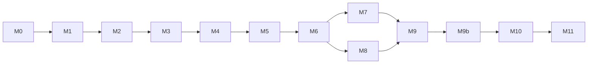

# NegSwift — macOS Lite Shell Plan

A macOS-only SwiftUI app that reuses **upstream NegPy** as a drop-in processing engine. No algorithm fork: NegSwift owns UI, orchestration, and packaging; NegPy owns pixels, pipeline, and file formats.

**License:** GPL-3.0 for the whole shipped product (Swift shell + bundled engine). NegPy is GPL-3.0; combining and distributing them requires the same license and source availability for NegSwift’s own code.

---

## Plan status (last updated: 2026-08-14)

| Milestone | Status | Notes |
|-----------|--------|-------|
| **M0** Bootstrap | **Done** | `Makefile`; GitHub CI not yet wired |
| **M1** Engine CLI | **Done** | `info`, `open`; `tests/test_cli.py` |
| **M2** Render PNG | **Done** | `render` CLI; `tests/test_render.py` |
| **M3** NDJSON daemon | **Partial** | `serve --stdio`; `load_config` added for M6. Missing: `cancel`, Unix socket, `save_config` |
| **M4** Swift + preview | **Done** | Engine spawn, Open File → canvas |
| **M5** Film strip | **Done** | Import Folder, lazy thumbnails |
| **M6** Controls | **Done** | Sliders, process mode, debounced preview |
| **M7** Persist | **Done** | `save_config`, debounced `.negpy` sidecars |
| **M8** Crop | **Done** | Crop overlay, rotation, aspect ratio, fine rotation |
| **M9** Export | **Next** | — |
| M10–M11 | Not started | — |

**Resume here:** M9 — engine export + Swift export sheet.

**Verify:** `make test` (14 engine tests) · crop to 3:2 · rotate 90° · quit/reopen restores geometry.

---

## 1. Goals

| Goal | Detail |
|------|--------|
| **Simpler UI** | Import → preview → essential sliders → export. No scanner tabs, dodge/burn editor, gear library, contact sheets, etc. in v1. |
| **Drop-in NegPy** | Engine imports `negpy` from a path/git/PyPI dependency. Upstream updates = bump dependency, re-run tests. |
| **Incremental delivery** | Each milestone produces something you can run and **manually verify** before the next. |
| **Edit compatibility** | Same `WorkspaceConfig` JSON, `.negpy` sidecars, and optional shared `edits.db` as desktop NegPy. |
| **macOS first** | Metal via NegPy’s existing `wgpu` path; native SwiftUI chrome; ColorSync-friendly preview. |

### Non-goals (lite v1)

- Windows/Linux
- SANE scanner UI, gphoto2 tethering, RGB-scan merge UI, stitch UI
- Full panel parity with NegPy desktop (history branching, work prints, metadata gear library, soft-proof UI, printing notes)
- Rewriting pipeline in Swift/Metal (future option only)

---

## 2. Architecture

```
┌─────────────────────────────────────────────────────────────────┐
│  NegSwift.app (Swift / SwiftUI)                                 │
│  • Film strip, canvas, simplified controls                      │
│  • Engine lifecycle (spawn, health, cancel)                       │
│  • Display: NSImage / Metal texture from engine bytes           │
└───────────────────────────┬─────────────────────────────────────┘
                            │ JSON-RPC over Unix domain socket
                            │ (dev: stdio or TCP localhost)
┌───────────────────────────▼─────────────────────────────────────┐
│  negswift-engine (Python helper — bundled in production)         │
│  • Thin wrapper: no duplicated math                             │
│  • Imports: negpy.services.*, negpy.domain.*, negpy.features.*  │
│  • Long-lived daemon OR one-shot CLI per milestone              │
└───────────────────────────┬─────────────────────────────────────┘
                            │ import
┌───────────────────────────▼─────────────────────────────────────┐
│  negpy (upstream — git submodule from M9b; sibling path in early dev) │
│  PreviewManager, ImageProcessor, StorageRepository, sidecar I/O   │
│  DarkroomEngine / GPUEngine (WGSL → Metal on macOS)             │
└─────────────────────────────────────────────────────────────────┘
```

### Why a separate engine process

- **Isolation:** NumPy/Numba/wgpu crashes do not take down SwiftUI.
- **Cancellation:** Kill or supersede in-flight render without fighting the GIL on the UI thread.
- **Packaging:** One frozen helper binary inside `Contents/Resources/`; Swift stays a normal Xcode app.
- **Future portability:** A stable JSON boundary is easier to swap (embedded CPython today, different host tomorrow) than linking Python into the app binary.

### Key NegPy APIs (no fork required)

| Need | Upstream module |
|------|-----------------|
| Load scan | `PreviewManager.load_preview(...)` |
| Render preview | `ImageProcessor.run_pipeline(...)` + display transform |
| Export | `ImageProcessor.process_export(...)` |
| Config | `WorkspaceConfig.to_dict()` / `from_flat_dict()` |
| Persist | `StorageRepository`, `negpy.services.assets.sidecar` |
| Hash / identity | `negpy.kernel.image.logic.calculate_file_hash` |
| Defaults | `negpy.kernel.system.config.DEFAULT_WORKSPACE_CONFIG` |

The desktop app’s `RenderWorker` is the reference implementation for preview rendering — NegSwift’s engine replicates that **orchestration**, not the Qt signals.

---

## 3. Upstream NegPy as drop-in

NegPy is wired in two phases:

| Phase | Milestones | Source layout |
|-------|------------|---------------|
| **Early dev** | M0–M9 | Sibling checkout (`../../NegPy`) *or* submodule — either works |
| **Pinned upstream** | **M9b → M10+** | **Git submodule required** at `Vendor/NegPy` |

M9b is a **hard gate before M10**. Packaging and CI must not rely on a machine-specific sibling path.

### Dependency declaration

**M0–M9 (early dev)** — sibling checkout is fine for fast iteration:

```toml
# Engine/pyproject.toml
[tool.uv.sources]
negpy = { path = "../../NegPy", editable = true }
```

**M9b onward (canonical)** — submodule inside the NegSwift repo:

```toml
[tool.uv.sources]
negpy = { path = "../Vendor/NegPy", editable = true }
```

Add the submodule once (during M9b):

```bash
git submodule add https://github.com/marcinz606/NegPy.git Vendor/NegPy
git submodule update --init --recursive
# Pin to a tag or commit validated by M9 export tests, then commit the submodule SHA.
cd Vendor/NegPy && git checkout 0.49.0  # example tag
cd ../.. && git add Vendor/NegPy && git commit -m "Pin NegPy submodule for M9b"
```

Clone instructions for contributors:

```bash
git clone --recurse-submodules https://github.com/you/NegSwift.git
# or after a plain clone:
git submodule update --init --recursive
```

**Dual-repo hacking (optional escape hatch):** document `NEGPY_PATH` or a local `Engine/pyproject.override.toml` (gitignored) so NegPy contributors can point `uv` at a sibling checkout without changing the committed submodule SHA. CI and release builds **never** use the override.

```toml
# Example gitignored Engine/pyproject.override.toml
[tool.uv.sources]
negpy = { path = "/absolute/path/to/NegPy", editable = true }
```

### Rules

1. **Never copy** `negpy/features/*/logic.py` or shaders into NegSwift.
2. **Engine code only** wraps imports, IPC, and lite-specific defaults (e.g. hidden config fields fixed to defaults).
3. **Upstream gaps** get small PRs to NegPy (optional headless entrypoint, env var for user dir) rather than forks.
4. **Version pin** — from M9b on, the submodule commit (or tag) is the pin; bump it deliberately with parity + manual export tests.
5. **M10 builds** consume `Vendor/NegPy` only — no `../../NegPy` in CI or PyInstaller scripts.

### Suggested upstream contributions (optional, small)

| Change in NegPy | Why |
|-----------------|-----|
| `negpy/headless/` package with stable render/export functions | Keeps NegSwift engine thin; benefits CLI/automation too |
| `NEGPY_USER_DIR` env override in `kernel/system/paths.py` | Sandbox engine data under `~/Library/Application Support/NegSwift/` |
| Document minimal render recipe in `docs/PIPELINE.md` | Onboarding for alternate UIs |

None of these block Milestone 1 — the engine can call existing APIs immediately.

---

## 4. Packaging: PyInstaller vs embedded CPython

Both ship a self-contained app with **no user Python install**. Recommendation: **hybrid**.

| Phase | Approach | Rationale |
|-------|----------|-----------|
| **Dev (M0–M9)** | `uv run` + sibling NegPy *or* submodule | Fast iteration, normal tracebacks |
| **M9b** | Switch to **`Vendor/NegPy` submodule** | Reproducible pin before any bundling |
| **Beta (M10)** | **PyInstaller `--onedir`** for `negswift-engine` only | Freeze from submodule tree; no Qt → smaller than full NegPy |
| **Release (M10+)** | Evaluate **embedded CPython 3.13 framework** in bundle | Easier engine updates without full freeze; closer to long-term embedding story |

### PyInstaller (engine only)

- Entry: `Engine/negswift_engine/__main__.py` (no PyQt6).
- Reuse NegPy’s hidden-import list **minus** Qt/scanner/camera unless lite adds them later.
- Must bundle: WGSL shader dirs, `icc/`, `crosstalk/`, `gear/` data from NegPy package resources.
- Output: `negpy-engine/` directory → copy to `NegSwift.app/Contents/Resources/engine/`.

**Pros:** Single artifact, no `.venv` in bundle, matches NegPy release engineering.  
**Cons:** Slow rebuilds, opaque tracebacks in production, PyInstaller + numba/wgpu quirks.

### Embedded CPython (future-friendly)

- Ship `Python.framework` (or python.org standalone build) + venv with `negpy` wheels inside the app bundle.
- Launch: `Contents/Resources/engine/python -m negswift_engine`.
- Code-sign the framework and all `.so` extensions.

**Pros:** Swap venv for engine updates; debug with same layout as dev; aligns with experimental **Python embed** paths (not App Store Python — see §10).  
**Cons:** Larger bundle if not stripped; signing complexity.

### Decision gate (Milestone 10)

**Prerequisite:** M9b complete — submodule pinned, CI uses `--recurse-submodules`, `Engine/pyproject.toml` points at `Vendor/NegPy`.

Ship PyInstaller if freeze works reliably on arm64 + x86_64 within one week. Otherwise embed CPython and document the signing steps. **Do not block UI milestones M4–M9 on packaging or submodule work.**

---

## 5. Engine IPC protocol

Spec lives in `docs/ENGINE_PROTOCOL.md`. Summary:

- **Transport:** Unix domain socket at `~/Library/Application Support/NegSwift/engine.sock` (dev: `--stdio` or `--port 17352`).
- **Framing:** newline-delimited JSON (NDJSON), one request → one response (or chunked preview).
- **Auth:** local only; socket file mode `0600`.

### Core methods (v1)

| Method | Purpose |
|--------|---------|
| `ping` | Health check |
| `info` | Version, negpy version, GPU backend name |
| `open` | Register path → `{ hash, width, height, has_sidecar }` |
| `load_preview` | Decode to working buffer (optional splash JPEG first) |
| `render` | `{ path, config }` → `{ png_base64 \| shared_memory_handle, metrics }` |
| `export` | `{ path, config, export_settings, dest }` → `{ output_path }` |
| `load_config` / `save_config` | Sidecar + optional DB |
| `cancel` | Abort in-flight `render` / `export` by job id |

Preview responses use **PNG bytes (base64)** in v1 for simplicity; Milestone 7+ can add shared memory or raw RGBA + width/height for Metal upload.

---

## 6. Lite UI scope

### Included in v1

- Folder import + film strip (grid of thumbnails)
- Canvas preview (fit / 1:1 zoom, pan)
- **Setup:** process mode (C-41 / B&W in NegSwift; E-6 in full NegPy), auto density / auto grade
- **Tone:** density, grade, saturation (single slider)
- **Colour:** WB cyan/magenta/yellow
- **Geometry:** auto crop, rotation, aspect ratio preset
- **Export:** JPEG + TIFF, sRGB, next to source or chosen folder
- Persist edits (`.negpy` sidecar; optional same DB path as NegPy)

### Deferred (open in full NegPy)

- Dodge/burn, retouch brush, local masks
- Lab sharpening/clahe sliders, toning, finish borders/carrier
- Scanner/camera capture, flat-field profile editor
- History panel, work prints, metadata/gear, export presets/templates
- Soft proof, printing notes, contact sheets

Lite edits remain **forward-compatible**: fields left at defaults round-trip in desktop NegPy.

---

## 7. Incremental milestones

Each milestone lists **automated** checks and a **manual smoke test** you can run locally.

---

### M0 — Repository bootstrap ✅

**Deliverables**

- [x] Xcode macOS app target (`App/NegSwift/`) — empty window, menu bar
- [x] `Engine/pyproject.toml` with path dep on NegPy (sibling `../../NegPy` is fine until M9b)
- [x] `Engine/negswift_engine/` package skeleton
- [x] GPL-3.0 LICENSE, README, this plan, `.gitignore`
- [ ] CI stub: GitHub Actions (`ruff` + `pytest` + `xcodebuild`) — **`Makefile` exists locally**

**Automated:** `uv sync` in `Engine/` succeeds; `xcodebuild -scheme NegSwift build` succeeds.

**Manual:** Launch empty NegSwift.app — window appears, Quit works.

---

### M1 — Engine CLI (no Swift yet) ✅

**Deliverables**

- [x] `negswift-engine info` — prints NegPy version, GPU available
- [x] `negswift-engine open <path>` — prints content hash and dimensions
- [x] Logging to stderr; JSON result on stdout

**Uses:** `calculate_file_hash`, `PreviewManager` or lightweight loader.

**Automated:** `tests/test_cli.py` (was planned as `test_cli_open.py`).

**Manual:**

```bash
cd Engine && uv run negswift-engine info
uv run negswift-engine open ~/Pictures/scans/frame001.tif
# Expect JSON with hash, width, height; no Python traceback
```

---

### M2 — Preview render to PNG ✅

**Deliverables**

- [x] `negswift-engine render --path ... --out preview.png [--config config.json]`
- [x] Default `WorkspaceConfig`; optional JSON overrides
- [x] GPU with CPU fallback (same as NegPy)

**Uses:** `PreviewManager.load_linear_preview`, `ImageProcessor.run_pipeline`, `apply_display_transform`, PNG encode (`Engine/negswift_engine/render.py`).

**Automated:** pytest compares output shape and finite pixels; optional SSIM vs golden if checked in small test asset.

**Manual:**

```bash
uv run negswift-engine render --path ~/Pictures/scans/frame001.tif --out /tmp/negswift_preview.png
open /tmp/negswift_preview.png
# Expect recognizable positive; compare with same frame in NegPy desktop
```

---

### M3 — Engine daemon + NDJSON protocol ⚠️ partial

**Deliverables**

- [x] `negswift-engine serve --stdio`
- [x] Implement `ping`, `info`, `open`, `render` over NDJSON
- [x] `discover` (added for M5; not in original v0.1 sketch)
- [x] `load_config` (M6)
- [x] `save_config`
- [ ] `negswift-engine serve --socket PATH`
- [ ] Job ids + `cancel`
- [ ] `save_config`
- [x] `docs/ENGINE_PROTOCOL.md` v0.1 (evolving)

**Automated:** `tests/test_protocol.py`, `tests/test_render.py`, `tests/test_discover.py`.

**Manual:**

```bash
uv run negswift-engine serve --stdio
# In another terminal:
echo '{"id":1,"method":"ping"}' | uv run negswift-engine serve --stdio
echo '{"id":2,"method":"render","params":{"path":"..."}}' | ...
# Or use Engine/scripts/smoke_client.py
```

---

### M4 — Swift shell: connect + show image ✅

**Deliverables**

- [x] `EngineClient` Swift actor — spawn engine subprocess, NDJSON over stdin/stdout (dev)
- [x] Open file dialog → `render` → display `NSImage` in canvas
- [x] Loading spinner + error alert
- [x] `NegSwiftEnginePath` via merged `Info.plist` + `NEGSWIFT_ENGINE_PATH` build setting

**Automated:** Swift unit tests with mocked transport — **not yet** (template XCTest only).

**Manual:** Run from Xcode → Open → pick scan → preview appears within ~5s for a typical TIFF.

---

### M5 — Film strip + folder import ✅

**Deliverables**

- [x] Folder import (`fileImporter` + engine `discover`); extensions match NegPy loaders
- [x] Lazy thumbnail generation via engine (`render` at 256px long edge)
- [x] Selection drives main canvas

**Automated:** `tests/test_discover.py`.

**Manual:** Import folder of 20+ frames; scroll strip; click each — preview updates; no UI freeze > 1s between clicks (stale preview ok while rendering).

---

### M6 — Essential controls (live preview) ✅

**Deliverables**

- [x] SwiftUI sliders: density, grade, saturation (Chroma), WB CMY
- [x] Debounced render (300 ms) + stale-job generation guard
- [x] `Auto Density` / `Auto Grade` toggles (`auto_exposure`, `auto_normalize_contrast`)
- [x] Engine `load_config` + `render` with partial `WorkspaceConfig`

**Uses:** `WorkspaceConfig` patches via `resolve_config`; auto metering in NegPy exposure stage.

**Automated:** `tests/test_config.py`; `DebounceSchedulerTests` in NegSwiftTests.

**Manual:** Load orange-mask negative; toggle auto density — preview brightens sensibly; drag grade — contrast changes; compare side-by-side with NegPy desktop same sliders.

---

### M7 — Persist edits ✅

**Deliverables**

- [x] Auto-save `WorkspaceConfig` to `.negpy` sidecar on change (1 s debounce)
- [x] Flush save on frame switch, background, and engine restart
- [x] Load sidecar on frame select via `load_config`
- [ ] Optional: shared `edits.db` via `NEGPY_USER_DIR` — deferred

**Uses:** `write_sidecar`, `load_sidecar`; engine `save_config` merges partial edits onto stored config.

**Automated:** `tests/test_config.py::test_save_config_round_trip`.

**Manual:** Edit frame → quit → reopen → edits restored; NegPy desktop opens same sidecar.

---

### M8 — Crop + rotation ✅

**Deliverables**

- [x] Canvas overlay: crop rect with corner handles + dimmed outside region
- [x] Rotation ±90° (NegPy quarter-turn `rotation` field)
- [x] Fine rotation slider (±45°, NegPy `fine_rotation` convention)
- [x] Aspect ratio picker (``CROP_RATIO_CHOICES`` subset)
- [x] Crop Tool toggle + Reset; geometry persisted in sidecar

**Uses:** `GeometryConfig` — `manual_crop_rect`, `rotation`, `fine_rotation`, `autocrop_ratio`.

**Automated:** `tests/test_config.py::test_save_geometry_round_trip`.

**Manual:** Crop to 3:2; rotate CW; quit/reopen — crop and rotation restored.

---

### M9 — Export

**Deliverables**

- [ ] Engine `export` method — JPEG/TIFF, sRGB
- [ ] Swift export sheet: format, destination
- [ ] Progress + cancel

**Uses:** `ImageProcessor.process_export`, same as `ExportWorker`.

**Automated:** export produces valid file; PIL/imageio can read; dimensions match expectation.

**Manual:** Export full-res JPEG; open in Preview/Photos; compare with NegPy desktop export same settings.

---

### M9b — NegPy git submodule (required before M10)

Switch from an ad-hoc sibling checkout to a **pinned git submodule**. This milestone is packaging prep, not user-facing features — but it must pass before any bundling work.

**Deliverables**

- [ ] `Vendor/NegPy` submodule → `https://github.com/marcinz606/NegPy.git`
- [ ] Submodule SHA pinned to a NegPy tag or commit validated by M9 export tests
- [ ] `Engine/pyproject.toml` → `negpy = { path = "../Vendor/NegPy", editable = true }`
- [ ] `uv lock` refreshed; `uv sync` works from a clean `--recurse-submodules` clone
- [ ] CI: `git submodule update --init --recursive` before engine tests
- [ ] README + `Engine/README.md`: clone with `--recurse-submodules`; document optional `pyproject.override.toml` for dual-repo dev
- [ ] `.gitmodules` committed; sibling-path docs marked as early-dev only

**Automated:** CI green on a fresh clone with submodules only (no sibling NegPy).

**Manual:**

```bash
# Simulate a new contributor
cd /tmp && git clone --recurse-submodules <NegSwift repo>
cd NegSwift/Engine && uv sync && uv run negswift-engine info
# Re-run M9 export smoke test — same output as before M9b
```

**Bump procedure (ongoing):** merge or tag upstream NegPy → `cd Vendor/NegPy && git fetch && git checkout <tag>` → run M2/M6/M9 manual checks → commit updated submodule SHA in NegSwift.

---

### M10 — Bundle for distribution

**Deliverables**

- [ ] **M9b complete** (submodule is the only NegPy source for this milestone)
- [ ] PyInstaller (or embedded CPython) build script in `Packaging/` — inputs from `Vendor/NegPy`
- [ ] Xcode copy-files phase: engine into `Contents/Resources/`
- [ ] App finds engine relative to bundle; sets `NEGPY_USER_DIR` to Application Support
- [ ] Signed/notarized build instructions in `docs/RELEASE.md`

**Automated:** CI builds `.app`, runs `negswift-engine info` from inside bundle.

**Manual:** Copy `.app` to another Mac (no Python installed) → import → render → export.

---

### M11 — Polish (post-MVP)

- Process mode picker (C-41 / E-6 / B&W)
- E-6 normalization toggle
- Preferences: preview quality, GPU toggle, shared DB path
- Drag-and-drop import
- Keyboard: space toggle fit, Cmd+O, Cmd+E

---

## 8. Project structure

```
NegSwift/
├── PLAN.md                          # This document
├── README.md
├── LICENSE                          # GPL-3.0
├── .gitmodules                      # NegPy submodule (from M9b)
├── Vendor/
│   └── NegPy/                       # git submodule — canonical upstream pin (M9b+)
├── App/
│   ├── NegSwift.xcodeproj
│   └── NegSwift/
│       ├── NegSwiftApp.swift
│       ├── Models/
│       │   └── WorkspaceConfig+Lite.swift   # Codable mirror of flat dict subset
│       ├── Services/
│       │   ├── EngineClient.swift
│       │   └── EngineProcess.swift
│       └── Views/
│           ├── ContentView.swift
│           ├── FilmStripView.swift
│           ├── CanvasView.swift
│           └── Controls/
│               ├── ToneControls.swift
│               └── ColourControls.swift
├── Engine/
│   ├── pyproject.toml
│   ├── negswift_engine/
│   │   ├── __init__.py
│   │   ├── main.py                  # CLI + serve
│   │   ├── protocol.py              # NDJSON dispatch
│   │   ├── render.py                # PreviewManager + ImageProcessor glue
│   │   ├── persist.py               # sidecar + repository
│   │   └── paths.py                 # NEGSWIFT_USER_DIR / NEGPY_USER_DIR
│   └── tests/
│       ├── test_cli_open.py
│       ├── test_render.py
│       └── test_protocol.py
├── Packaging/
│   ├── build_engine.sh              # PyInstaller
│   ├── engine.spec                  # derived from NegPy build.py minus Qt
│   └── embed_python.sh              # optional CPython path
├── Tests/
│   └── NegSwiftTests/               # Swift tests
└── docs/
    ├── ENGINE_PROTOCOL.md
    ├── MANUAL_TEST_CHECKLIST.md
    └── RELEASE.md
```

---

## 9. Testing strategy

| Layer | Tool | When |
|-------|------|------|
| Engine unit | `pytest` via `uv run` | Every commit |
| Protocol | Python client → `serve --stdio` | M3+ |
| Render parity | Optional: same frame NegSwift vs NegPy SSIM threshold | M2, M6, M9 |
| Swift UI | XCTest + mocked `EngineClient` | M4+ |
| Integration | Tag `@pytest.mark.integration` — needs GPU + sample scan | CI optional / nightly |
| Manual | `docs/MANUAL_TEST_CHECKLIST.md` per milestone | Before tagging |

**Parity rule:** Lite does not reimplement math; if preview differs from NegPy desktop, treat as **engine wiring bug**, not “Swift UI bug”.

---

## 10. iOS and long-term notes

**iOS is not in scope for this plan.** App Store rules, no arbitrary subprocesses, and no full CPython/NumPy stack make “drop-in NegPy” impractical on iPhone/iPad today.

What *does* transfer if iOS ever matters:

- **Stable JSON config** (`WorkspaceConfig`) — already Codable-friendly as flat dict
- **IPC boundary** — today engine is local; tomorrow could be macOS helper syncing via CloudKit while iOS shows proxies only
- **Embedded CPython on macOS** — practice for “host process + script engine” without PyInstaller

A future iOS app would likely need **Metal port of subset pipeline** or **render-on-Mac sync** — not PyInstaller. Keeping NegSwift’s engine behind a clean protocol avoids painting into a corner.

---

## 11. GPL-3.0 compliance checklist

- [ ] `LICENSE` in NegSwift repo (done)
- [ ] `NOTICE` crediting NegPy upstream and copyright holders
- [ ] Source link in About box + README
- [ ] If distributing binary: offer corresponding source (GitHub satisfies for public repo)
- [ ] Document that shipped bundle contains NegPy under GPL-3.0

---

## 12. Risks and mitigations

| Risk | Mitigation |
|------|------------|
| Submodule drift / forgotten init | Document `--recurse-submodules`; CI fails fast if `Vendor/NegPy` empty |
| PyInstaller + wgpu/numba fails | Fall back to embedded CPython; build always from submodule tree |
| Large app size (~200MB+) | Engine-only freeze (no Qt); strip tests/docs from bundle |
| Preview latency | Debounce, cancel jobs, reuse `PreviewManager` cache |
| Config drift vs NegPy | Always serialize full `WorkspaceConfig`; lite UI only *shows* subset |
| GPU OOM on huge scans | Same preview downscale as desktop (`preview_render_size`) |
| Code signing embedded Python | Document entitlements; sign all `.so`; use `--onedir` |

---

## 13. Immediate next steps

1. **M9:** Engine `export` method + Swift export sheet (JPEG/TIFF, sRGB).
2. **M3 debt (optional):** `cancel`, Unix socket transport.
3. **M0 debt:** GitHub Actions running `make test` + `make build-app`.
4. **M9b** before any M10 packaging — submodule pin at `Vendor/NegPy`.

---

## Appendix A — Reference render flow (engine)

Pseudocode matching desktop `RenderWorker`:

```python
from dataclasses import replace
from negpy.kernel.system.config import APP_CONFIG, DEFAULT_WORKSPACE_CONFIG
from negpy.services.rendering.preview_manager import PreviewManager
from negpy.services.rendering.image_processor import ImageProcessor
from negpy.infrastructure.display.color_mgmt import apply_display_transform
from negpy.kernel.image.logic import float_to_uint8

def render_preview(path: str, config: WorkspaceConfig, source_hash: str) -> np.ndarray:
    pm = PreviewManager()
    processor = ImageProcessor()
    buffer, dims, meta = pm.load_preview(path, ...)  # see PreviewLoadWorker for args
    result, metrics = processor.run_pipeline(
        buffer, config, source_hash,
        render_size_ref=APP_CONFIG.preview_render_size,
        prefer_gpu=True,
    )
    if hasattr(result, "readback"):
        result = result.readback()[:, :, :3]
    rgb = apply_display_transform(result, working_color_space)
    return float_to_uint8(rgb)
```

Export path: `processor.process_export(file_info, params, export_settings, ...)`.

---

## Appendix B — Milestone dependency graph



M1–M3 require no Swift. M4 is the first end-to-end user-visible app. **M9b blocks M10** — submodule pin before bundling.
